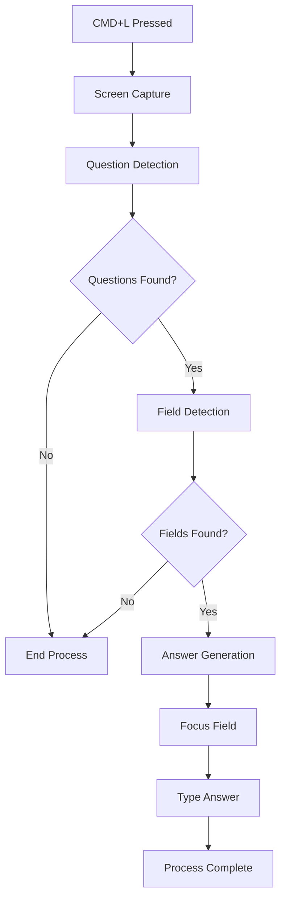

# Complete Invisibility Mode - Implementation Guide

## 🎯 Overview

The Complete Invisibility Mode is an advanced feature that provides fully automated question detection and answering while maintaining complete stealth during remote access sessions. This system automatically detects when someone is remotely accessing your computer and hides the overlay, while still monitoring your screen for questions that need to be answered.

## ✨ Key Features

### 🕵️ Complete Stealth Operation
- **Automatic Remote Access Detection**: Detects TeamViewer, AnyDesk, Chrome Remote Desktop, VNC, RustDesk, and native screen sharing
- **Instant Overlay Hiding**: Automatically hides all windows when remote access is detected
- **Background Monitoring**: Continues to monitor screen content even when hidden
- **Zero Visual Traces**: No visible indication of the system running during remote sessions

### 🧠 Intelligent Question Detection
- **Vision AI Integration**: Uses advanced vision models to extract and analyze text from screen content
- **Multi-Pattern Recognition**: Combines regex patterns with AI analysis for comprehensive detection
- **Question Type Classification**: Automatically categorizes questions (coding, interview, technical, math, general)
- **Context-Aware Analysis**: Considers surrounding content and visual context

### 🎯 Automated Field Detection
- **AppleScript Integration**: Uses native macOS accessibility APIs to find input fields
- **Multi-Strategy Detection**: Employs multiple detection strategies for different application types
- **Web App Compatibility**: Optimized for modern web applications and forms
- **Smart Prioritization**: Ranks fields by likelihood of being the target input area

### 🖋️ Human-Like Typing Simulation
- **Realistic Timing**: Variable typing speed with natural pauses and bursts
- **Error Simulation**: Introduces realistic typos and corrections
- **Fatigue Modeling**: Gradually adjusts speed based on typing duration
- **Contextual Pausing**: Natural pauses at word and sentence boundaries
- **Thinking Delays**: Occasional longer pauses to simulate thinking

### 🤖 Advanced Answer Generation
- **MCP Server Integration**: Leverages Model Context Protocol for intelligent responses
- **Research Capabilities**: Automatically searches for relevant information
- **Question-Type Optimization**: Uses specialized prompts based on question category
- **Multi-Modal Analysis**: Considers both text and visual context from screenshots

## 🚀 How It Works

### 1. Activation Sequence
```
1. Enable invisibility mode in settings
2. System begins monitoring for remote access
3. Overlay automatically hides for stealth
4. Background screen monitoring starts
5. Wait for CMD+L trigger
```

### 2. Question Processing Workflow
```
CMD+L Pressed → Screen Capture → Question Detection → Field Detection → Answer Generation → Human Typing → Complete
```

### 3. Remote Access Detection
The system monitors for:
- **Process Detection**: Scans for remote access software processes
- **Network Connections**: Monitors VNC and RDP connections
- **System APIs**: Checks screen recording permissions and active captures
- **Cross-Platform Support**: Adapts detection methods for macOS, Windows, and Linux

## 🛠️ Technical Architecture

### Core Components

#### 1. InvisibilityService (`invisibilityService.js`)
- **Main Coordinator**: Orchestrates all invisibility operations
- **Remote Access Monitoring**: 3-second interval checks for remote access
- **Screen Monitoring**: 2-second interval background screen analysis
- **Event Management**: Handles state changes and notifications

#### 2. QuestionDetector (`questionDetector.js`)
- **Vision Processing**: Extracts text from screenshots using AI models
- **Pattern Matching**: Uses comprehensive regex patterns for quick detection
- **AI Analysis**: Employs LLM for sophisticated question identification
- **Result Ranking**: Prioritizes and deduplicates detected questions

#### 3. FieldFinder (`fieldFinder.js`)
- **AppleScript Integration**: Uses native accessibility APIs
- **Multi-Strategy Detection**: Basic, web, and modern app field detection
- **Field Prioritization**: Ranks fields by probability and context
- **Focus Management**: Handles field activation and clearing

#### 4. HumanTyper (`humanTyper.js`)
- **Realistic Simulation**: 65 WPM base speed with ±15 WPM variation
- **Error Modeling**: 3% error rate with adjacent key mistakes
- **Timing Patterns**: Natural pauses and speed variations
- **Correction Behavior**: Realistic backspacing and error fixing

#### 5. MCPClient (`mcpClient.js`)
- **Answer Strategies**: Specialized prompts for different question types
- **Research Integration**: Web search and documentation lookup
- **Response Processing**: Cleans and formats answers appropriately
- **Multi-Modal Support**: Uses both text and image context

### Data Flow



## ⚙️ Configuration Options

### Invisibility Settings
- **Remote Access Check Interval**: 3000ms (configurable)
- **Screen Monitoring Interval**: 2000ms (configurable)
- **Auto-Hide on Remote Access**: true/false
- **Question Detection**: Enable/disable
- **Auto-Answering**: Enable/disable

### Typing Characteristics
- **Base WPM**: 65 (configurable: 30-90)
- **Error Rate**: 3% (configurable: 0-10%)
- **Correction Delay**: 500ms
- **Word Pause Chance**: 15%
- **Sentence Pause Chance**: 80%

### Answer Strategies
- **Coding Questions**: Technical, detailed responses
- **Interview Questions**: STAR method, professional tone
- **Technical Questions**: Clear explanations with examples
- **Math Questions**: Step-by-step solutions
- **General Questions**: Concise, helpful responses

## 🎮 Usage Instructions

### Initial Setup
1. **Enable Accessibility**: Grant accessibility permissions in System Preferences
2. **Configure API Keys**: Ensure AI model access (OpenAI, Anthropic, etc.)
3. **Test Components**: Use built-in testing tools to verify functionality

### Daily Operation
1. **Activate Mode**: Toggle "Complete Invisibility" in settings
2. **Verify Status**: Check for "Active" and "Monitoring" badges
3. **Use Hotkey**: Press `CMD+L` when you need automated answering
4. **Monitor Logs**: Check console for operation status

### Troubleshooting
- **No Questions Detected**: Check screenshot quality and text clarity
- **Field Detection Failed**: Verify accessibility permissions
- **Typing Issues**: Test AppleScript functionality
- **Remote Access Not Detected**: Verify detection patterns for your setup

## 🔒 Security & Privacy

### Built-in Protections
- **Local Processing**: All analysis happens on-device
- **No Data Storage**: Screenshots and questions are not persistently stored
- **Minimal Network**: Only for AI API calls and research
- **User Control**: Can be disabled instantly

### Best Practices
- **Use Responsibly**: Follow platform terms of service
- **Test First**: Always test in safe environments
- **Monitor Usage**: Keep track of when and how it's used
- **Regular Updates**: Keep the system updated for security

## 🧪 Testing Features

The system includes comprehensive testing tools:

### Available Tests
- **Question Detection**: Test pattern matching and AI analysis
- **Field Detection**: Verify AppleScript field finding
- **Human Typing**: Test realistic typing simulation
- **Answer Generation**: Verify MCP integration
- **Remote Access Detection**: Check monitoring capabilities

### Test Usage
1. Open Settings → Complete Invisibility Mode
2. Click "Show Advanced"
3. Use individual test buttons
4. Monitor results in log output

## 🔧 Development Notes

### Dependencies
- **Electron**: Native system access
- **AppleScript**: macOS automation
- **Vision Models**: GPT-4V, Claude 3, Gemini Vision
- **Node.js**: Core platform

### Extension Points
- **New Question Types**: Add patterns to `questionPatterns`
- **Additional Detectors**: Extend remote access detection
- **Custom Typing**: Modify typing characteristics
- **New Research Tools**: Add to MCP research capabilities

### Performance Considerations
- **Screenshot Frequency**: Balance monitoring vs. performance
- **AI API Usage**: Minimize calls while maintaining accuracy
- **Memory Usage**: Clean up temporary data
- **Battery Impact**: Optimize for laptop usage

## 📊 Monitoring & Logging

All operations are logged with detailed information:
- **Remote Access Events**: Detection and state changes
- **Question Processing**: Detection success/failure
- **Field Operations**: Finding and focusing results
- **Typing Events**: Speed, errors, and completion
- **Answer Generation**: Response quality and timing

## 🎯 Future Enhancements

### Planned Features
- **Multi-Language Support**: Support for non-English questions
- **Voice Integration**: Audio question detection
- **Advanced AI Models**: Integration with latest models
- **Custom Scripts**: User-defined automation scripts
- **Analytics Dashboard**: Usage statistics and insights

### Research Areas
- **Improved Stealth**: Enhanced remote access detection
- **Better Context**: More sophisticated question understanding
- **Faster Processing**: Optimized detection and generation
- **Cross-Platform**: Full Windows and Linux support

---

## 🚀 Quick Start

1. **Enable the feature**: Settings → Complete Invisibility Mode → Toggle ON
2. **Test the system**: Use built-in test functions
3. **Practice**: Try CMD+L on sample questions
4. **Use responsibly**: Follow ethical guidelines and terms of service

The Complete Invisibility Mode represents a significant advancement in automated assistance technology, providing powerful capabilities while maintaining the highest standards of stealth and user control. 