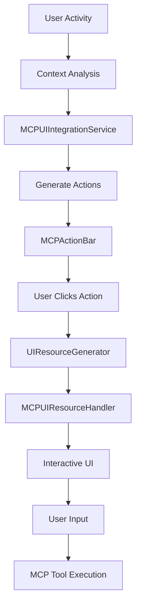

# MCP Integrated UI Guide

## Overview

MCP UI is now deeply integrated into Leviousa 101's natural workflow, providing contextual actions based on user activities rather than being a standalone feature. This guide explains how the integrated MCP UI system works and how to use it effectively.

## Key Concepts

### Contextual Actions

Instead of having a separate MCP UI section, actions appear contextually throughout the app:

1. **Ask Mode**: When you type questions or requests, relevant MCP actions appear automatically
2. **Listen Mode**: After conversations, appropriate follow-up actions are presented
3. **During Conversations**: Real-time actions based on conversation content

### No More Toggle

MCP UI is now always available - there's no separate toggle to enable/disable it. Actions appear when they're relevant and useful.

## How It Works

### 1. Ask Bar Integration

When you type in the Ask bar, the system analyzes your message and shows relevant actions:

- **Email Mentions**: If you mention "email", you'll see a "📧 Send Email" action (not just draft!)
- **Meeting/Calendar**: Mentioning "meeting" or "calendar" shows "📅 Schedule Meeting"
- **LinkedIn/Profile**: Mentioning "LinkedIn" or "profile" shows "🔍 LinkedIn Lookup"

Example:
```
You: "I need to send an email to John about our meeting"
Actions: [📧 Send Email] [📅 Schedule Meeting]
```

### 2. Listen Mode Actions

After a listening session completes, you'll see contextual actions:

- **📝 Save to Notion**: Save the meeting summary directly to your Notion workspace
- **📅 Schedule Follow-up**: Book a follow-up meeting with participants
- **✉️ Send Summary Email**: Send meeting notes to participants

### 3. Real-time Conversation Actions

During conversations, actions appear based on context:

- **👥 View LinkedIn Profiles**: When participants are mentioned
- **📅 Book Meeting**: When scheduling is discussed
- **📧 Send Email**: When follow-ups are mentioned

## Available Actions

### Email Actions

- **Send Email**: Opens an interactive email composer with Gmail integration
- **Send Summary Email**: Pre-fills email with meeting summary

### Calendar Actions

- **Schedule Meeting**: Interactive calendar widget to book meetings
- **Schedule Follow-up**: Quick booking for follow-up meetings

### Notes Actions

- **Save to Notion**: Save summaries, notes, or action items to Notion
- **Create Summary**: Generate and save formatted summaries

### LinkedIn Actions

- **LinkedIn Lookup**: Search and view LinkedIn profiles
- **Connect on LinkedIn**: Send connection requests

## Using MCP UI Actions

### 1. Click an Action Button

When you see an action button (e.g., "📧 Send Email"), simply click it.

### 2. Interactive UI Opens

A modal window appears with an interactive form:
- For emails: Composer with To, Subject, Body fields
- For calendar: Date/time picker with attendees
- For Notion: Title, content, and workspace selection
- For LinkedIn: Profile cards with connection options

### 3. Complete the Action

Fill in the details and click the action button (Send, Schedule, Save, etc.)

### 4. Action Executes via MCP

The action is executed through the connected MCP services with proper authentication.

## Architecture

### Components

1. **MCPUIIntegrationService**: Core service that manages contextual actions
2. **MCPActionBar**: UI component that displays action buttons
3. **MCPUIResourceHandler**: Handles interactive UI resources (modals)
4. **UIResourceGenerator**: Creates interactive UI components

### Flow



## Configuration

### Prerequisites

1. MCP services must be configured and authenticated:
   - Gmail for email actions
   - Google Calendar for meeting actions
   - LinkedIn for profile actions
   - Notion for note-saving actions

2. OAuth tokens must be valid for the services you want to use

### Checking Tool Availability

The system automatically checks which MCP tools are available and only shows relevant actions.

## Security

- All UI resources are rendered in sandboxed iframes
- HTML content is sanitized with DOMPurify
- OAuth tokens are securely managed
- Actions require user confirmation

## Troubleshooting

### Actions Not Appearing

1. Check if relevant MCP services are connected
2. Ensure OAuth authentication is complete
3. Verify the context matches action triggers

### Action Fails to Execute

1. Check MCP service status in Settings > Invisibility
2. Re-authenticate the service if needed
3. Check console logs for detailed error messages

### UI Resource Not Loading

1. Ensure JavaScript is enabled
2. Check for browser console errors
3. Verify MCP UI Integration Service is running

## Examples

### Example 1: Sending an Email

1. Type in Ask bar: "Send an email to the team about the project update"
2. Click "📧 Send Email" action
3. Email composer opens with pre-filled subject
4. Add recipients, edit content
5. Click "Send" to send via Gmail

### Example 2: Saving Meeting Notes

1. Complete a Listen session
2. Click "📝 Save to Notion" in the summary view
3. Notion saver opens with meeting summary
4. Select workspace and add tags
5. Click "Save" to create Notion page

### Example 3: LinkedIn Lookup

1. During conversation, mention someone's name
2. Click "🔍 LinkedIn Lookup"
3. View profile cards of matching people
4. Click "Connect" to send connection request

## Future Enhancements

- More contextual triggers
- Additional MCP service integrations
- Custom action workflows
- Batch actions support
- Action history and undo

## Developer Guide

### Adding New Actions

1. Register action in `MCPUIIntegrationService.registerContextualActions()`
2. Create handler method for the action
3. Add UI resource generator if needed
4. Update context analysis logic

### Creating Custom UI Resources

```javascript
// In UIResourceGenerator
static generateCustomAction(data) {
  const html = `
    <div class="custom-action">
      <h2>${data.title}</h2>
      <button onclick="window.parent.postMessage({type: 'ui-action', tool: 'custom.action', params: {...}}, '*')">
        Execute Action
      </button>
    </div>
  `;
  
  return {
    type: 'resource',
    resource: {
      uri: `ui://custom-action/${Date.now()}`,
      mimeType: 'text/html',
      title: data.title,
      text: html
    }
  };
}
```

## Summary

MCP UI is now an invisible layer that enhances your workflow with contextual actions. No configuration needed - just use Leviousa normally and relevant actions will appear when you need them! 