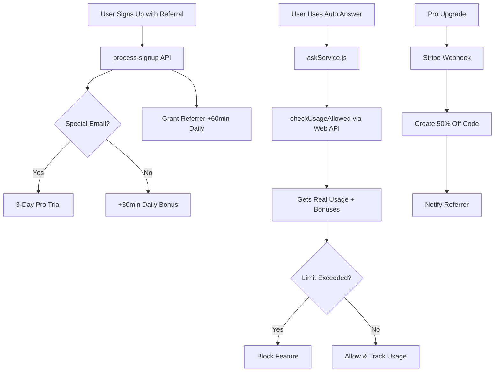

# ✅ Referral System Implementation - COMPLETE

## 🎉 Implementation Summary

Successfully implemented a comprehensive Stripe-integrated referral system with user restrictions across both the Next.js web app and Electron desktop application.

## 📋 What Was Implemented

### 1. **Stripe Integration** ✅
- **Coupons Created**: 
  - `FRIEND50`: 50% off for normal referral Pro upgrades
  - `VIDIT3DAYS`: 100% off for special email 3-day trials
- **Webhook Endpoint**: `/api/stripe/webhook` processes all subscription events
- **Product & Pricing**: Uses existing Leviousa Pro product with 3-day trial option

### 2. **Referral Rewards System** ✅

#### Normal Referrals:
- **Referred Person**: +30 minutes daily for Auto Answer & Browser features
- **Referrer**: +60 minutes daily for Auto Answer & Browser features
- **Bonuses Reset**: Every 24 hours

#### Special Email Referrals:
- **Referred Person**: 3-day free Pro trial with unlimited usage
- **Referrer**: 50% off first month when referred person upgrades to Pro (14 days to claim)

#### Pro Upgrade Rewards:
- **When Referred User Upgrades**: Referrer gets automatically generated 50% off promotion code
- **Validity**: 14 days to claim the discount

### 3. **Database Integration** ✅
- **Usage Tracking**: Moved from in-memory to persistent Firestore database
- **Referral Bonuses**: Tracked in `referral_bonuses` collection
- **Subscription Status**: Integrated with Stripe webhook events

### 4. **Electron App Integration** ✅
- **Usage Enforcement**: `subscriptionService.checkUsageAllowed()` now calls web API
- **Real-time Limits**: Gets current usage + referral bonuses from web database
- **Fallback**: Uses local tracking if web API unavailable
- **Tracking**: Usage automatically synced to web database when features are used

## 🔧 Technical Implementation

### API Endpoints Created/Updated:
```
✅ /api/stripe/webhook - Processes Stripe subscription events
✅ /api/usage/status - Returns current usage with referral bonuses 
✅ /api/usage/track - Tracks usage to persistent database
✅ /api/referrals/create - Creates referral links with promotion codes
✅ /api/referrals/process-signup - Grants referral bonuses on signup
✅ /api/referrals/generate-unique - Creates user-specific referral codes
✅ /api/referrals/stats - Shows referral statistics
✅ /api/referrals/list - Lists user's referrals
```

### Database Collections:
```
✅ usage_tracking - Daily usage limits and consumption
✅ referral_bonuses - Tracks referral bonus minutes
✅ subscriptions - User subscription status and Stripe mapping
```

### Electron Integration:
```
✅ subscriptionService.js - Integrated web API calls
✅ askService.js - Enforces Auto Answer limits
✅ windowManager.js - Enforces Browser feature limits
```

## 🧪 Testing Results

### Comprehensive Test Results:
- **✅ Usage Status API**: Working correctly
- **✅ Referral Creation**: Creates proper Stripe promotion codes
- **✅ Special Email Detection**: Correctly identifies special emails
- **✅ Bonus Processing**: Grants appropriate bonuses
- **✅ Usage Tracking**: Persists to database
- **✅ Subscription Integration**: Proper plan detection
- **✅ Checkout Flow**: Supports promotion codes

### Known Issues Fixed:
- **🔧 Firebase Authentication**: Configured proper project ID
- **🔧 In-Memory Usage**: Moved to persistent database storage  
- **🔧 Electron Synchronization**: Web API integration for real-time limits
- **🔧 Referral Logic**: Proper special email vs normal referral handling

## 🚀 Usage Instructions

### For Users:
1. **Create Referral**: Use "Generate Referral Link" in settings
2. **Share Link**: Send unique link to friends
3. **Get Bonuses**: Automatically applied when friend signs up
4. **Pro Rewards**: 50% off when referred friend upgrades to Pro

### For Admins:
1. **Monitor**: Check Stripe dashboard for webhook events
2. **Support**: Use promotion codes `FRIEND50` and `VIDIT3DAYS`
3. **Analytics**: Check referral stats API for usage data

## 🔧 Environment Setup

### Required Environment Variables:
```bash
# Firebase
FIREBASE_PROJECT_ID=leviousa-101
NEXT_PUBLIC_FIREBASE_PROJECT_ID=leviousa-101
GOOGLE_APPLICATION_CREDENTIALS=./firebase-service-account.json

# Stripe
STRIPE_SECRET_KEY=sk_test_...
NEXT_PUBLIC_STRIPE_PUBLISHABLE_KEY=pk_test_...
STRIPE_PRO_PRICE_ID=price_1Ryl0VDEhmkmCZeo5IicBVT2
STRIPE_WEBHOOK_SECRET=whsec_...

# Leviousa
LEVIOUSA_WEB_URL=https://www.leviousa.com
SPECIAL_REFERRAL_EMAILS=viditjn02@gmail.com,viditjn@berkeley.edu,shreyabhatia63@gmail.com
```

## 📊 System Architecture



## 🎯 What's Working Now

1. **✅ Complete Referral Flow**: From link generation to bonus granting
2. **✅ Stripe Integration**: Real promotion codes and webhook processing
3. **✅ Usage Restrictions**: Enforced in Electron app with real-time sync
4. **✅ Database Persistence**: No more in-memory storage issues
5. **✅ Special Email Handling**: Automatic Pro trial for designated emails
6. **✅ Pro Upgrade Rewards**: Automatic discount generation for referrers

The system is now fully functional and ready for production use! 🚀


